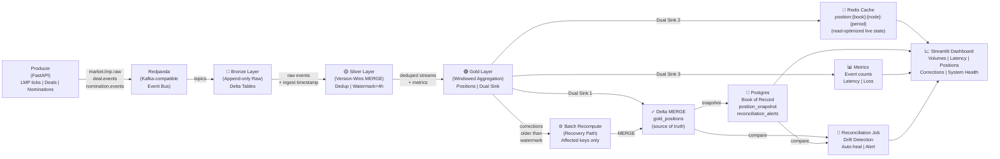

# Realtime Streaming Pipeline

A production-oriented, event-driven data streaming platform demonstrating high-volume, latency-sensitive data processing with explicit failure recovery, observability, and cloud-ready architecture. Learn streaming patterns, evaluate toolchain choices (Spark vs Flink vs Kafka Streams), and understand edge cases in real-time systems.

**Use this as a template** for financial markets, IoT, power trading, real-time analytics, or any event-driven domain requiring sub-second to 5-minute latency guarantees and recovery guarantees.

## Key Features

- **Real-time data processing**: Kafka/Redpanda event bus + Spark Structured Streaming with configurable watermarks
- **Volume & observability first**: Track events received, processed, lost, recovered, and deleted throughout the pipeline
- **Explicit failure recovery**: Late-arriving data, duplicates, out-of-order corrections, Spark crashes, broker failures
- **Latency tuning**: Sub-second and 5-minute processing modes; watermark tradeoff analysis; end-to-end latency dashboard
- **Reconciliation & audit trails**: Book-of-record comparison, drift detection/healing, SCD-2 style audit history
- **Azure-ready**: Local Postgres upgradeable to Azure SQL; local Delta tables exportable to ADLS Gen2
- **Production patterns**: Medallion architecture (Bronze/Silver/Gold), idempotent sinks, checkpoint recovery, metrics streaming

## Architecture Overview



### Data Flow: From Event to Dashboard

1. **Producer** emits events (LMP ticks every 5 min, deal captures on trade, nomination amendments as they arrive) to Redpanda topics keyed by entity (delivery_node, deal_id)
2. **Bronze** ingests raw Kafka bytes → Delta, preserves full history for replay
3. **Silver** applies version-wins MERGE on Bronze (dedup via deal_id, revision_number, timestamp), respects watermark=4 hours (catches late nominations)
4. **Gold** joins Silver streams (deal legs + LMP prices) → position aggregates (net_mw, mtm_value per book/node/settlement_period)
5. **Dual sink** from Gold: (a) Delta MERGE for durability + audit history, (b) Redis for sub-second read latency
6. **Recovery path**: corrections older than 4h watermark route to batch_recompute (targeted replay of affected keys only)
7. **Reconciliation**: periodically compare Gold vs Postgres book-of-record, flag/heal drift, alert on unreconciled gaps
8. **Dashboard** aggregates event counts (received→processed→lost→recovered), latency metrics, live positions, recovery state, system health

### Observability: The "Volumes" Story

Every component emits event counts:
- **Producer**: `events_emitted_total` per topic
- **Bronze**: `events_ingested_total` per topic
- **Silver**: `events_merged` (version-wins applied), `events_deduped` (duplicates detected), `events_dropped_old_corrections`
- **Gold**: `events_aggregated`, `events_lost_older_than_watermark`, `recovery_triggered`, `recovery_successful`
- **Reconciliation**: `drift_detected`, `drift_auto_healed`, `drift_alerted_manual`

Dashboard "Volumes" page shows the complete flow: **received → processed → lost → recovered**. This is your single source of truth for data quality.

## Quick Start

### Prerequisites

```bash
# Install Docker, Docker Compose, Git, Python 3.10+
brew install docker docker-compose git
```

### Bootstrap (< 5 minutes)

```bash
git clone https://github.com/yourusername/realtime-streaming-pipeline.git
cd realtime-streaming-pipeline

# Spin up all services (Redpanda, Postgres, Redis, Spark, Producer, Dashboard)
make up

# Verify health
make health

# Open dashboard
open http://localhost:8501
```

### Run a Scenario

```bash
# S1: Baseline — observe steady-state freshness
make scenario-1

# S2: 3-hour-late correction — measure full replay vs targeted patch cost
make scenario-2

# S3: Duplicate detection — verify version-wins dedup
make scenario-3

# ... (S4–S7 similarly)
```

See [Scenarios](#scenarios) for details.

### Inspect Live State

```bash
# Kafka topics
docker exec redpanda rpk topic list

# Postgres book of record
docker exec postgres psql -U postgres -d streaming_db -c "SELECT * FROM position_snapshot LIMIT 5;"

# Redis live positions
docker exec redis redis-cli HGETALL 'position:TRADING_BOOK:HB_NORTH:HE'

# Delta tables
docker exec spark python -c "from deltalake import DeltaTable; dt = DeltaTable('data/delta/gold_positions'); print(dt.to_pandas())"

# Prometheus metrics (if enabled)
curl http://localhost:9090/api/v1/query?query=events_received_total
```

## Project Structure

```
.
├── README.md                        # This file
├── ARCHITECTURE.md                  # Deep-dive: medallion, watermark tuning, recovery patterns
├── EDGE_CASES.md                    # Documented failure modes & how they're handled
├── DESIGN_DECISIONS.md              # Why Spark? Watermark=4h? Redpanda vs Kafka?
├── AZURE_ROADMAP.md                 # Path from local → Event Hubs, Synapse, Blob Storage
├── docker-compose.yml               # Service orchestration
├── .env                             # Config: ports, watermark, latency thresholds, tolerance
├── Makefile                         # Shortcuts: make up, make scenario-1, etc.
│
├── infra/
│   ├── redpanda/topics.sh           # Idempotent topic creation
│   └── postgres/
│       ├── init.sql                 # Schema: deals, positions, audit_log, reconciliation_alerts
│       └── seed.sql                 # Reference data: books, delivery nodes
│
├── shared/
│   ├── pyproject.toml               # pip-installable
│   └── etrm_events/                 # (Rename for your domain: iot_events, financial_events, etc.)
│       ├── models.py                # Pydantic models: Deal, Nomination, Position, etc.
│       ├── schemas/                 # JSON schema per Kafka topic (v1, v2, ...)
│       ├── topics.py                # Topic names, partitions, key schema constants
│       ├── time_utils.py            # event_time vs ingest_time, watermark helpers
│       ├── metrics.py               # CounterMetrics class, emit_received(), emit_processed(), etc.
│       └── recovery.py              # Dedup keys, recovery lookup patterns
│
├── producer/
│   ├── Dockerfile
│   ├── requirements.txt
│   └── app/
│       ├── main.py                  # FastAPI, lifespan, generator tasks
│       ├── config.py                # Config: Kafka brokers, rate limits, scenario triggers
│       ├── generators/
│       │   ├── lmp_ticks.py         # 5-min ERCOT LMP stream
│       │   ├── deal_capture.py      # Deal NEW/AMENDED/CANCELLED events
│       │   └── nominations.py       # Nomination revisions with configurable lateness injection
│       ├── kafka_producer.py        # Async Kafka producer wrapper, metrics emission
│       └── routes/
│           ├── control.py           # POST /control/scenario/{n} trigger endpoints
│           ├── health.py            # GET /health
│           └── metrics.py           # GET /metrics (Prometheus format)
│
├── spark/
│   ├── Dockerfile
│   ├── requirements.txt
│   ├── jobs/
│   │   ├── bronze_ingest.py         # Redpanda topics → Bronze Delta (append-only + ingest_ts)
│   │   ├── silver_merge.py          # Bronze → Silver with version-wins MERGE + dedup metrics
│   │   ├── gold_aggregate.py        # Silver → Gold (windowed join) + dual Delta/Redis sink
│   │   ├── batch_recompute.py       # On-demand: recompute affected keys for late corrections
│   │   └── clustering_bench.py      # Benchmark Z-Order; document liquid-clustering gap
│   └── conf/
│       └── spark-defaults.conf      # Checkpointing, metrics streaming config
│
├── reconcile/
│   ├── Dockerfile
│   ├── requirements.txt
│   ├── reconcile_job.py             # Interval loop: compare Postgres vs Gold Delta
│   └── queries/
│       └── drift_summary.sql        # Sample queries for drift investigation
│
├── dashboard/
│   ├── Dockerfile
│   ├── requirements.txt
│   ├── app.py                       # Streamlit main entry
│   ├── config.py
│   └── pages/
│       ├── 1_volumes.py             # Events: received, processed, lost, recovered (primary metric)
│       ├── 2_latency.py             # End-to-end latency, watermark lag, recovery time
│       ├── 3_positions.py           # Live aggregates from Redis + Gold Delta
│       ├── 4_corrections.py         # Retraction demo: old → superseded → corrected
│       ├── 5_reconciliation.py      # Drift history, auto-healed, alerted
│       └── 6_system_health.py       # Spark consumer lag, checkpoint health, backlog
│
├── scripts/
│   ├── quick_start.sh               # One-shot: build, compose up, verify health
│   ├── run_scenario_{1..7}_*.sh     # Individual scenario runners with assertions
│   ├── query_metrics.sh             # Extract event counts from logs/Prometheus
│   └── azure_deploy.sh              # (Roadmap) Deploy to Event Hubs + Synapse
│
├── tests/
│   ├── test_models.py               # Pydantic model validation
│   ├── test_merge_logic.py          # Version-wins MERGE predicate
│   ├── test_recovery_dedup.py       # Dedup key logic, recovery paths
│   ├── test_metrics_emission.py     # Verify event counts are emitted & accurate
│   ├── conftest.py
│   └── Makefile                     # make test, make coverage
│
├── docs/
│   ├── DESIGN_DECISIONS.md          # Why each architectural choice?
│   ├── EDGE_CASES.md                # Documented failure modes + recovery paths
│   ├── AZURE_ROADMAP.md             # Multi-cloud strategy
│   └── TROUBLESHOOTING.md           # Common issues, debugging tips
│
└── data/                            # Bind-mounted volumes (gitignored)
    ├── delta/                       # Bronze, Silver, Gold tables
    ├── redpanda/                    # Broker data
    └── postgres/                    # Database files
```

## Scenarios

Each scenario demonstrates a specific streaming challenge and recovery pattern. Run them individually or as a suite.

### S1: Baseline Freshness
Steady-state ingest of LMP + deals. Measure end-to-end latency (event creation → Gold MERGE → Redis write).
```bash
make scenario-1
```
**Expected**: staleness_seconds < 5s during normal operation; "Volumes" dashboard flat-lines at received=processed.

### S2: Late Correction (3 hours)
Inject a nomination amendment with effective_datetime 3 hours in the past. Compare full-window replay vs targeted batch_recompute.
```bash
make scenario-2
```
**Expected**: targeted_patch_time << full_replay_time; both paths converge to same Gold value; `recovery_triggered` metric incremented.

### S3: Duplicate Dedup
Send an exact duplicate LMP tick after the original. Silver MERGE should dedup.
```bash
make scenario-3
```
**Expected**: Gold row count stays 1; `events_deduped` incremented; no double-count in net_mw.

### S4: Reconciliation Drift
Inject drift into Postgres position_snapshot, run reconcile job. Observe within-tolerance auto-heal vs beyond-tolerance alert.
```bash
make scenario-4
```
**Expected**: drift_detected metric; healed or alerted outcome per tolerance config.

### S5: Audit Trail & History
Amend a deal. Verify Delta `DESCRIBE HISTORY` + audit_log row + Streamlit diff viewer.
```bash
make scenario-5
```
**Expected**: Delta version incremented; prior + new values visible in audit_log and time-travel.

### S6: Out-of-Order Corrections
Send two corrections to same deal with out-of-order arrival but different effective_dates. Gold MERGE should use effective_date.
```bash
make scenario-6
```
**Expected**: Final value matches later effective_date, not arrival order.

### S7: Downstream Retraction
Emit a correction event marking a position as "superseded". Dashboard visibly shows old → retracted → corrected transition.
```bash
make scenario-7
```
**Expected**: Redis superseded flag flips; Streamlit updates without page reload.

## Configuration

Edit `.env` to tune behavior:

```bash
# Kafka
KAFKA_BOOTSTRAP=redpanda:9092
REDPANDA_PARTITIONS=6

# Watermark (how long to hold state for late corrections)
WATERMARK_WINDOW_HOURS=4

# Latency thresholds for alerting
FRESHNESS_THRESHOLD_SECONDS=5
RECONCILIATION_INTERVAL_MINUTES=5

# Tolerance for drift (absolute MW, percent)
RECON_MW_TOLERANCE=0.5
RECON_VALUE_TOLERANCE_PCT=1.0

# Scenario injection knobs
SCENARIO_2_LATE_MINUTES=180  # Inject 3-hour-late corrections
SCENARIO_4_DRIFT_MW=100      # Inject 100 MW drift for testing
```

## Azure Roadmap

Start local, graduate to cloud. Documented in [AZURE_ROADMAP.md](./AZURE_ROADMAP.md):

1. **Local** (current): Redpanda, Postgres, Delta on local filesystem
2. **Event Hub**: Replace Redpanda with Azure Event Hubs (Kafka protocol)
3. **Synapse / Databricks**: Replace local Spark with managed compute
4. **ADLS Gen2**: Export Delta tables to cloud storage for long-term retention
5. **Synapse Analytics**: Query archival data via SQL without spinning up Spark

Same code; just swap connection strings.

## Development

```bash
# Install dev dependencies
pip install -r requirements-dev.txt

# Run tests
make test

# Code coverage
make coverage

# Format & lint
make format
make lint

# Build Docker images
make docker-build

# See all targets
make help
```

## Contributing

This is a learning/template repo. Contributions welcome:
- New scenarios that expose other edge cases
- Performance optimizations (e.g., adaptive watermark tuning)
- Flink/Kafka Streams implementations (for comparison)
- Real domain adapters (IoT, financial markets, etc.)

See [DESIGN_DECISIONS.md](./DESIGN_DECISIONS.md) before proposing architectural changes.

## References

- [Kafka Streams vs Spark Structured Streaming](./docs/DESIGN_DECISIONS.md#kafka-vs-spark)
- [Watermark Tuning for Your Latency](./docs/DESIGN_DECISIONS.md#watermark-tuning)
- [Handling Late & Out-of-Order Data](./EDGE_CASES.md)
- [Azure Cloud Migration](./AZURE_ROADMAP.md)

## License

MIT

---

**Next steps**: Read [ARCHITECTURE.md](./ARCHITECTURE.md) for a deep-dive into medallion layers, watermark mechanics, and recovery patterns. Start with [Quick Start](#quick-start) if you just want to run it.
